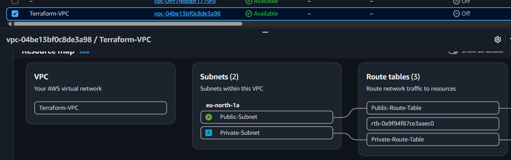
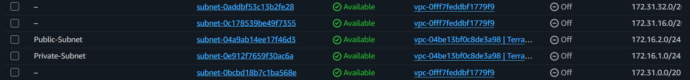
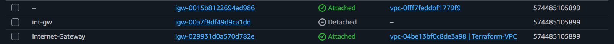
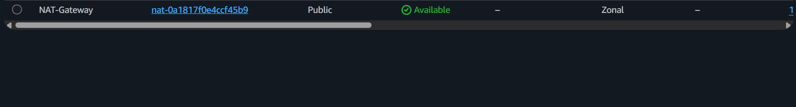
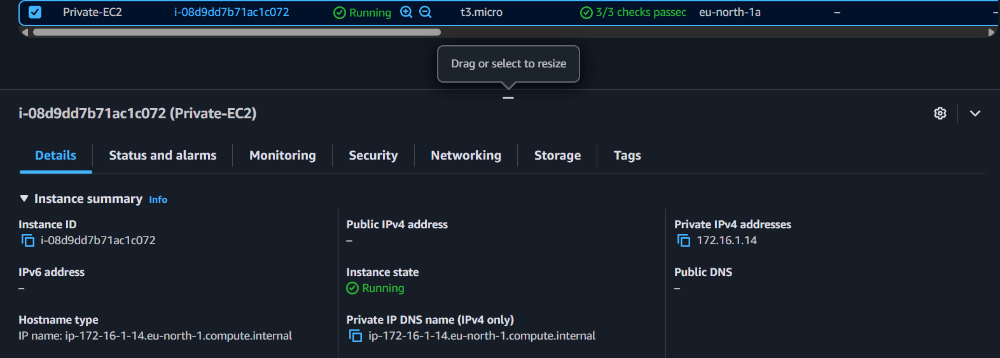

# AWS VPC Infrastructure with Terraform

## 📖 Project Overview

This project demonstrates how to provision a secure AWS networking infrastructure using **Terraform (Infrastructure as Code)**.

The infrastructure consists of a custom **Amazon VPC**, **Public and Private Subnets**, **Internet Gateway**, **NAT Gateway**, **Route Tables**, and an **Amazon EC2 Instance** deployed inside a private subnet.

The entire infrastructure was deployed and managed using Terraform, allowing infrastructure to be provisioned in a repeatable, automated, and version-controlled manner.

---

## 🎯 Project Objectives

- Provision AWS infrastructure using Terraform.
- Create a custom Amazon VPC.
- Create Public and Private Subnets.
- Configure an Internet Gateway.
- Deploy a NAT Gateway with an Elastic IP.
- Configure Public and Private Route Tables.
- Associate Route Tables with their corresponding subnets.
- Launch an EC2 instance inside the Private Subnet.
- Practice Infrastructure as Code (IaC) using Terraform.

---

## 🏗️ Architecture

<p align="center">

</p>

---

## ☁️ AWS Services Used

- Amazon VPC
- Amazon EC2
- Amazon Subnets
- Internet Gateway
- NAT Gateway
- Elastic IP
- Route Tables
- Route Table Associations
- AWS IAM
- Terraform

---

## 🛠️ Terraform Resources

- aws_vpc
- aws_subnet
- aws_internet_gateway
- aws_eip
- aws_nat_gateway
- aws_route_table
- aws_route_table_association
- aws_instance
- aws_ami (Data Source)

---

## 📂 Repository Structure

```text
terraform-project/

│── Architecture/
│   └── architecture-diagram.png

│── screenshots/
│   ├── VPC.png
│   ├── subnets.png
│   ├── Route-tables.png
│   ├── internet-gateway.png
│   ├── NAT-Gateway.png
│   ├── private-EC2.png
│   ├── Terraform plan.png
│   └── Terraform apply.png

│── main.tf
│── provider.tf

│── LICENSE
└── README.md
```

---

## 📄 Terraform Configuration Files

### main.tf

Contains the complete Terraform configuration responsible for provisioning the AWS infrastructure, including:

- Amazon VPC
- Public Subnet
- Private Subnet
- Internet Gateway
- NAT Gateway
- Elastic IP
- Route Tables
- Route Table Associations
- Amazon EC2 Instance

---

### provider.tf

Configures the AWS Provider and specifies the AWS Region where the infrastructure is deployed.

---

## ⚙️ Terraform Workflow

### Initialize Terraform

```bash
terraform init
```

Initializes the Terraform working directory and downloads the required provider plugins.

---

### Validate the Configuration

```bash
terraform validate
```

Validates the Terraform configuration before deployment.

---

### Preview the Execution Plan

```bash
terraform plan
```

Generates an execution plan showing which AWS resources will be created.

---

### Deploy the Infrastructure

```bash
terraform apply
```

Creates the AWS infrastructure defined in the Terraform configuration.

---

## 📸 Project Screenshots

### VPC Overview

<p align="center">

</p>

---

### Public and Private Subnets

<p align="center">

</p>

---

### Route Tables

<p align="center">

</p>

---

### Internet Gateway

<p align="center">

</p>

---

### NAT Gateway

<p align="center">

</p>

---

### EC2 Instance

<p align="center">

</p>

---

### Terraform Plan

<p align="center">

</p>

---

### Terraform Apply

<p align="center">

</p>

---

## 🎯 Skills Demonstrated

- Infrastructure as Code (IaC)
- Terraform
- AWS Networking
- Amazon VPC
- Public & Private Networking
- Internet Gateway
- NAT Gateway
- Route Tables
- EC2 Deployment
- AWS Infrastructure Automation
- Cloud Networking

---

## 📚 Key Learning Outcomes

Through this project I gained practical experience in:

- Provisioning AWS infrastructure using Terraform.
- Designing secure VPC networking architectures.
- Deploying infrastructure using Infrastructure as Code (IaC).
- Managing networking components programmatically.
- Understanding public and private subnet communication.
- Automating AWS infrastructure deployment.
- Following AWS networking best practices.

---

## 👨‍💻 Author

**Asem Al-Omari**

AWS Certified Solutions Architect – Associate

Cloud Engineer | AWS | Terraform | Cloud Computing
